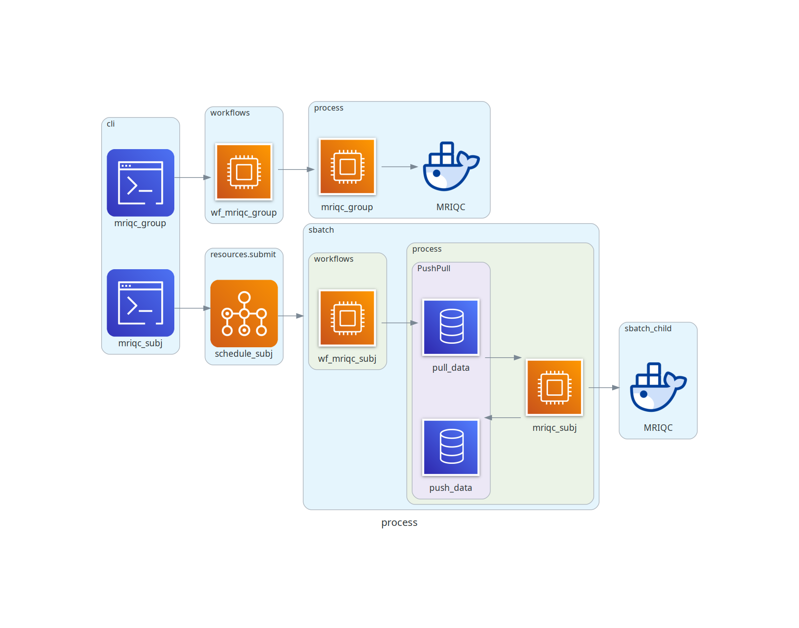

# func_mriqc
This package contains workflows for executing [MRIQC](https://mriqc.readthedocs.io/en/latest/) on individual subjects and groups. The individual subject workflow `mriqc_subj` is written for the Duke Compute Cluster (DCC) while the group workflow `mriqc_group` is written for labarserv2.

Sub-package navigation:
- [mriqc_subj](#mriqc_subj)
- [mriqc_group](#mriqc_group)


## General Usage
- Install into project environment on the DCC (see [here](https://github.com/labarlab/conda_dcc)) and/or labarserv2 (see [here](https://github.com/labarlab/conda_labarserv2)) via `$python setup.py install`.
- Trigger general package help and usage via entrypoint `$func_mriqc`.

```
(emorep)[nmm51-dcc: ~]$func_mriqc

Version : 1.1.0

This package conducts MRIQC for subject- and group-level MRI
datasets. Trigger helps and usages with the following entrypoints:

    mriqc_subj    : conduct subject-level MRIQC
    mriqc_group   : conduct group-level MRIQC
```

## General Requirements
- A singularity image of MRIQC on the DCC
- A docker container of MRIQC on labarserv2


## mriqc_subj
This sub-package executes MRIQC for each subject on the DCC.


### Setup
- Install into project environment on the DCC (see [here](https://github.com/labarlab/conda_dcc)) via `$ python setup.py install`
- Store a singularity image of MRIQC on the DCC
- Set the global variable `SING_MRIQC` to store the path to the singularity image
- Set the global varialbe `RSA_LS2` to store the path to an RSA key for labarserv2


### Usage
Trigger sub-package help and usage via `$ mriqc_subj`:

```
(emorep)[nmm51-dcc: ~]$mriqc_subj
usage: mriqc_subj [-h] [--fd-thresh FD_THRESH] [--proj-dir PROJ_DIR] [--proj-research PROJ_RESEARCH] -s SUB_LIST [SUB_LIST ...] -e
                  {ses-day2,ses-day3}

Conduct participant MRIQC.

Run subjects through "participant" mode of MRIQC. A single process of
MRIQC is conducted for each subject, whick coordinates data download
from Keoki, MRIQC execution, output upload to Keoki, and clean up.

Notes
-----
- Only supports single session at one time
- Written to be executed on the Duke Compute Cluster
- Requires global variables:
    - SING_MRIQC - path to singularity image of MRIQC
    - RSA_LS2 - path to RSA key for labarserv2

Example
-------
mriqc_subj \
    -s sub-ER0009 sub-ER0010 \
    -e ses-day2

optional arguments:
  -h, --help            show this help message and exit
  --fd-thresh FD_THRESH
                        Framewise displacement threshold
                        (default : 0.3)
  --proj-dir PROJ_DIR   Path to BIDS-formatted project directory
                        (default : /hpc/group/labarlab/EmoRep/Exp2_Compute_Emotion/data_scanner_BIDS)
  --proj-research PROJ_RESEARCH
                        Path to parent directory of mriqc.simg location
                        (default : /hpc/group/labarlab/research_bin)

Required Arguments:
  -s SUB_LIST [SUB_LIST ...], --sub-list SUB_LIST [SUB_LIST ...]
                        List of subject IDs to submit for MRIQC
  -e {ses-day2,ses-day3}, --sess {ses-day2,ses-day3}
                        BIDS session ID

```


### Functionality
The `mriqc_subj` workflow will schedule SBATCH jobs for each subject that will:
- Download data from Keoki
- Execute MRIQC for subject data
- Upload MRIQC results to Keoki

Output will be written to `derivatives/mriqc` and organized to default MRIQC output structure (BIDS).

Also, see [Diagrams](#diagrams)


### Considerations
- rawdata on Keoki needs to be in BIDS format (see [build_rawdata](https://github.com/labarlab-emorep/build_rawdata))
- Only a single session can be executed at once, triggering the workflow for different simultaneous sessions of the same subject will result in process failures


## mriqc_group
This sub-package executes MRIQC for the group on labarserv2 using output from `mriqc_subj`.


### Setup
- Install into project environment on labarserv2 (see [here](https://github.com/labarlab/conda_labarserv2)) via `$python setup.py install`
- Verify that docker is running `$systemctl show --property ActiveState docker`
- Download nipreps/mriqc container `$docker pull nipreps/mriqc:latest`


### Usage
Trigger sub-package help and usage via `$mriqc_group`:

```
(dev-nate_emorep)[nmm51-vm: ~]$mriqc_group
usage: mriqc_group [-h] [--proj-raw PROJ_RAW] -d DERIV_DIR

Conduct group MRIQC.

Use the output of mriqc_subj (subject-level MRIQC) to get
group-level stats.

Notes
-----
- Written to be executed on the local VM labarserv2
- Requires the docker container nipreps/mriqc

Example
-------
mriqc_group \
    -d /mnt/keoki/experiments2/EmoRep/Exp2_Compute_Emotion/data_scanner_BIDS/derivatives/mriqc

optional arguments:
  -h, --help            show this help message and exit
  --proj-raw PROJ_RAW   Path to BIDS-formatted project rawdata directory
                        (default : /mnt/keoki/experiments2/EmoRep/Exp2_Compute_Emotion/data_scanner_BIDS/rawdata)

Required Arguments:
  -d DERIV_DIR, --deriv-dir DERIV_DIR
                        Path to MRIQC derivatives directory
```


### Functionality
The `mriqc_group` workflow will conduct group-level analyses on `mriqc_subj` output. Output will be saved to derivatives/mriqc:

```
derivatives/mriqc/
├── dataset_description.json
├── group_bold.html
├── group_bold.tsv
├── group_T1w.html
└── group_T1w.tsv
```

Also, see [Diagrams](#diagrams)


## Diagrams
Diagram of processes, showing workflow as a function of package methods. Login (CLI) vs scheduled (parent, child sbatch) processes are also illustrated.


Diagram of imports.

